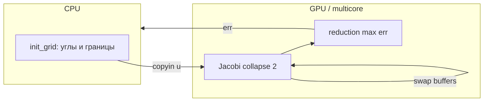

# Лабораторная работа №6 — Уравнение теплопроводности (2D, OpenACC)

## 1. Постановка задачи

Решается стационарное уравнение Лапласа (теплопроводность в установившемся режиме):

\[
\frac{\partial^2 u}{\partial x^2} + \frac{\partial^2 u}{\partial y^2} = 0
\]

на равномерной сетке \(N \times N\), \(N \in \{128, 256, 512, 1024\}\).

**Разностная схема (пятиточечный шаблон), метод Якоби** для внутренних узлов \((i,j)\), \(1 \le i,j \le N-2\):

\[
u_{i,j}^{(k+1)} = \frac{1}{4}\left(u_{i-1,j}^{(k)} + u_{i+1,j}^{(k)} + u_{i,j-1}^{(k)} + u_{i,j+1}^{(k)}\right).
\]

**Граничные условия:** значения на границе — линейная интерполяция между углами:

| Угол | Индекс | Значение |
|------|--------|----------|
| нижний левый | \((0,0)\) | 10 |
| нижний правый | \((N-1,0)\) | 20 |
| верхний правый | \((N-1,N-1)\) | 30 |
| верхний левый | \((0,N-1)\) | 20 |

Внутренность инициализируется нулями. Критерий останова: \(\max_{i,j} |u^{(k+1)}_{i,j} - u^{(k)}_{i,j}| < 10^{-6}\) или число итераций \(\ge 10^6\).

Исходный код: `heat_conduction.cpp`.

---

## 2. Параметры командной строки (boost::program_options)

| Параметр | Описание | По умолчанию |
|----------|----------|--------------|
| `--size`, `-s` | Размер сетки \(N\) | 128 |
| `--eps`, `-e` | Точность | 1e-6 |
| `--max-iters`, `-m` | Макс. итераций | 1000000 |
| `--optimized`, `-o` | Оптимизированный вариант | выкл. |
| `--print-grid`, `-p` | Печать всей сетки | авто при N=10, 13 |
| `--quiet`, `-q` | Только итерации и ошибка | выкл. |

Пример:

```bash
./build/heat_conduction --size 512 --eps 1e-6 --max-iters 1000000 --optimized
```

---

## 3. OpenACC и разбор `-Minfo=all`

Сборка:

```text
pgc++ -O3 -std=c++17 -acc=host|multicore|gpu -Minfo=all -fast \
  -o heat_conduction heat_conduction.cpp -lboost_program_options
```

### 3.1. Baseline (`--optimized` выключен)

- На **каждой** итерации: `#pragma acc data copy(u, u_new)` — полное копирование массивов.
- После шага: `#pragma acc update host(u_new)` и вычисление невязки **на CPU** по всей внутренности.
- В `-Minfo=all` типично видны частые **upload/download** и отсутствие длительного `present`-региона.

### 3.2. Optimized (`--optimized`)

- Один регион `#pragma acc data copyin(u) create(u_new)` на весь цикл итераций.
- Шаг Якоби: `parallel loop collapse(2) reduction(max:err)` — невязка на устройстве.
- Границы задаются один раз на хосте до `copyin`; в итерациях не пересчитываются.

**Что смотреть в `-Minfo=all`:**

1. Параллелизован ли цикл `collapse(2)` (gang/vector/worker).
2. Есть ли предупреждения *incomplete* data dependency или serial loop.
3. Объём **struct copy** / **device memory** при входе в `acc data`.

---

## 4. Сравнение производительности

Запуск:

```bash
./scripts/benchmark.sh
python3 plot_benchmark.py
```

Графики (после прогона на машине с GPU):

- `plots/time_host.png`, `plots/time_multicore.png`, `plots/time_gpu.png` — **до/после** (baseline vs optimized).
- `plots/speedup_all.png` — ускорение от оптимизации по режимам ACC.

### Таблица (заполнить после замеров на стенде)

| ACC | N | baseline, с | optimized, с | итераций | error |
|-----|---|-------------|--------------|----------|-------|
| host | 128 | | | | |
| host | 256 | | | | |
| multicore | 256 | | | | |
| gpu | 512 | | | | |
| gpu | 1024 | | | | |

*Для профилирования используйте `--max-iters 30` … `100`, иначе файл Nsight будет слишком большим.*

---

## 5. Профилирование Nsight Systems

```bash
./scripts/profile_nsight.sh build/heat_conduction 50 host
./scripts/profile_nsight.sh build/heat_conduction 80 gpu
```

В timeline отметить:

- CUDA API / OpenACC runtime (`acc_launch`, memcpy H↔D).
- Длительность ядра vs простои CPU.
- Повторяющиеся блоки memcpy в baseline (каждая итерация).

**Скриншот timeline:** *(вставить `images/nsight_host.png`, `images/nsight_gpu.png`)*

---

## 6. Проверка: сетки 10×10 и 13×13

```bash
./scripts/verify_small.sh ./build/heat_conduction
```

Сделать **скриншоты терминала** и вставить в отчёт:

- `images/grid_10x10.png`
- `images/grid_13x13.png`

Краткая проверка: углы 10/20/30/20, на границах — линейный профиль, в центре при достаточных итерациях — сглаженное поле между граничными значениями.

---

## 7. Ответы на вопросы анализа

### 7.1. Что ограничивает производительность?

1. **Пропускная способность памяти** — на каждой итерации каждый внутренний узел читает 4 соседа; для больших \(N\) это memory-bound задача.
2. **Частые H↔D копии** в baseline — доминируют на GPU при малом числе итераций или умеренном \(N\).
3. **Синхронизация** — остановка CPU для проверки `eps` каждую итерацию в baseline.
4. **Метод Якоби** — медленнее сходится, чем Гаусса–Зейделя / SOR → больше итераций при той же точности.
5. **`-acc=host`** — без реального параллелизма устройства; **multicore** ограничен NUMA и размером gang.

### 7.2. Как исправить ситуацию?

| Мера | Эффект |
|------|--------|
| Держать `u`, `u_new` на GPU весь цикл (`acc data` + `present`) | Убрать лишний PCIe |
| `reduction(max:err)` на устройстве | Реже синхронизировать CPU |
| `collapse(2)` + достаточный размер сетки | Загрузка всех SM / ядер |
| Red-black / Gauss–Seidel / multigrid | Меньше итераций при той же \(\varepsilon\) |
| Проверять `eps` раз в \(k\) итераций (только benchmark!) | Меньше sync (осторожно с корректностью) |

Реализовано в коде: флаг `--optimized`.

### 7.3. Делает ли программа что-то лишнее?

**Baseline — да:**

- Полный `copy` двух массивов каждую итерацию.
- `update host` всего `u_new` для невязки.
- Двойной проход по сетке (шаг + `max_diff_host`).

**Не лишнее:**

- Однократная установка границ и углов.
- Обмен указателей `swap` вместо копирования массивов.

**Не делается (и не требуется):** пересчёт границ на каждой итерации — они фиксированы.

---

## 8. Схема потока данных (optimized)



---

## 9. Выводы

1. Реализован решатель 2D Лапласа с пятиточечным шаблоном, `double`, CLI на Boost, OpenACC.
2. Baseline и optimized позволяют сравнить «до/после» и объяснить вывод `-Minfo=all`.
3. Скрипты `benchmark.sh`, `profile_nsight.sh`, `plot_benchmark.py` автоматизируют замеры и графики.
4. Основной выигрыш на GPU даёт **устранение лишних переносов данных**; дальнейший выигрыш — смена итерационного метода.

---

## 10. Приложение: команды для отчёта

```bash
make ACC=host && ./build/heat_conduction -s 10
make ACC=gpu && ./build/heat_conduction -s 256 --optimized -m 50
./scripts/benchmark.sh
python3 plot_benchmark.py
```

*Папка `images/` — для скриншотов терминала и Nsight (добавить вручную после прогона на стенде с NVIDIA HPC SDK).*
